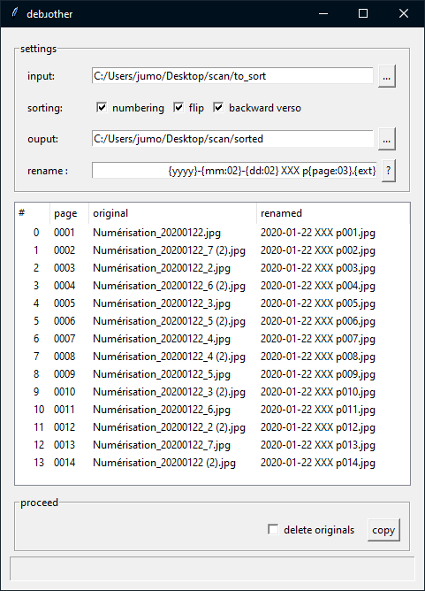

= debɹother: de-bother your brother
:author: Julien Morat
:email: julien.morat@gmail.com
:sectnums:
:toc:
:toclevels: 1
:experimental:

Sort *duplex* (recto-verso) files scanned with Brother.

When I use the charger of my scanner for *duplex scanning* (recto-verso),
files stored in complete *disorder*. Since the manufacturer does not bother to
provide tools for duplex scanning, I wrote this simple one (in python).

This software rename the scanned pages (files) in the correct order.

NOTE: Tis is designed for *Brother* multi-function (mfc-L2710DW) printer-scanner.
This tool is untested for other devices, but if you have tested other devices,
please, share me the results.

== Usage

You can either use __debɹother__ as command line or GUI.

=== GUI

.screenshot of main window

settings:

 - `input`: input root path directory. You can edit it directly or browse using `...`
 - `sorting`: the sorting strategies to use (see <<In details>>)
 - `output`: output path directory. You can edit it directly or browse using `...`. It will
 be created if not exists.
 - `rename`: the output file name syntax. Its using python `format` syntax.

.rename syntax
by default its set to  `{page:03d}.{ext}`, meaning:

 - `{page:03d}`: the page number using `0` padding on 3 characters,
 - `{ext}`: use the original file extension.

list:
 -  `original`: display the original file name (not the full path),
 -  `renamed`: display the file name once renamed (not the full path).

NOTE: you can click on the column title to sort by originals or renamed.

proceed:

 - `copy`: proceed the copy
 - `inplace`: proceed the copy and remove original files

== In details
[[details]]

=== numbering

Brother scanning tool create files named like :

.numbering
----
'Numérisation_20190527.jpg',
'Numérisation_20190527_2.jpg',
...
'Numérisation_20190527_9.jpg',
'Numérisation_20190527_10.jpg',
----

but you file system (eg. __windows__) use lexicographical sort to display files,
and it you have more that 10 pages, order is messed up, like :
.numbering
----
'Numérisation_20190527.jpg',
'Numérisation_20190527_10.jpg',
'Numérisation_20190527_2.jpg',
...
'Numérisation_20190527_9.jpg'
----

The "numbering" sort take care of that.
Other criteria (the rest of the file name) not considered, meaning leaved sorted
as before.

=== flip

=== backward verso
